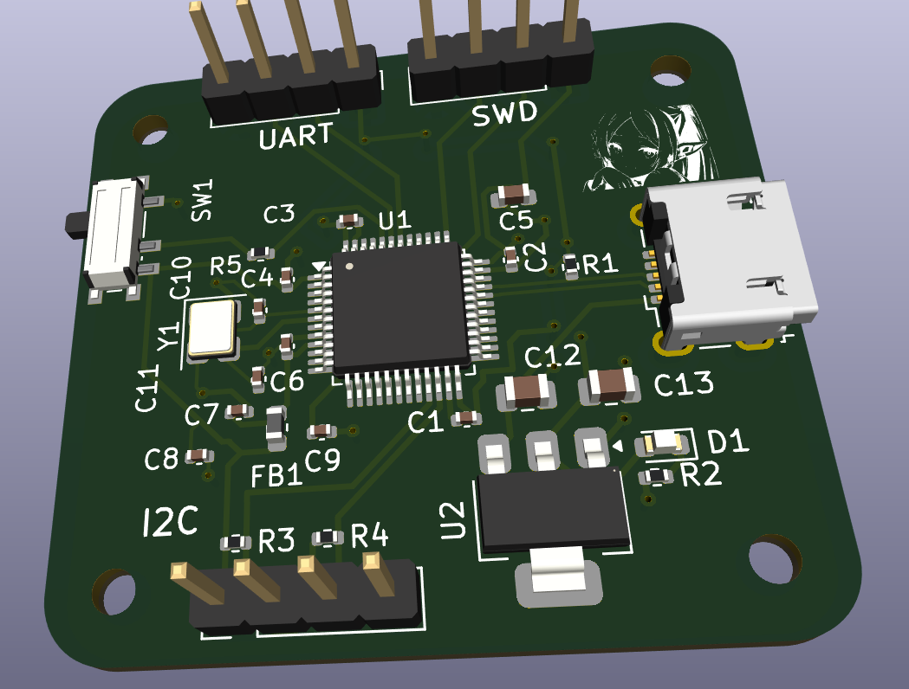
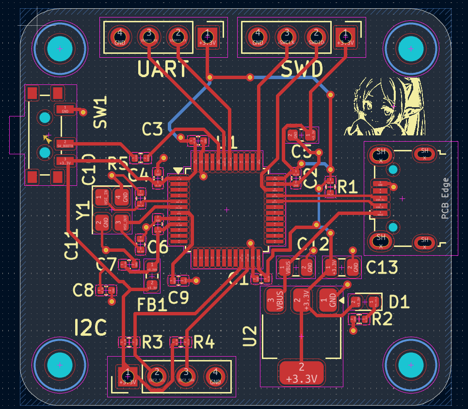

# STM32F103 PCB Learning Project

A custom 2-layer STM32F103C8T6 development board designed in **KiCad 10** as a project-driven introduction to PCB design, component selection, manufacturing preparation, and embedded hardware bring-up.

> **Status:** Rev. 1 PCB design complete. Manufacturing preparation and hardware bring-up in progress.

## Board Preview

| 3D view | Layout |
|---|---|
|  |  |


## Project Goals

I started this project to learn PCB design by building a real microcontroller board rather than only studying individual concepts in isolation.

The goal was to walk the complete hardware workflow end to end:

```
datasheet → schematic → footprint selection → PCB layout
    → BOM / CPL → manufacturing preparation → hardware bring-up
```

## Board Features

| Block | Part |
|---|---|
| MCU | STM32F103C8T6 (LQFP-48) |
| Regulator | AMS1117-3.3 (SOT-223) |
| Clock | 16 MHz HSE crystal + load capacitors |
| Power input | Micro-USB B connector |
| Debug | SWD header |
| Serial | UART header |
| Bus | I²C header |
| Indicator | Status LED |
| Analog supply | Ferrite bead + filter capacitors on VDDA |
| Configuration | BOOT selection switch |
| Stackup | 2-layer, 1.6 mm |

## What I Learned

### 1. A schematic is more than connecting pins

Before this project, PCB design looked like drawing lines between components. Building an STM32 board forced me to work from the datasheet and application notes, and to understand *why* each connection exists.

Pins I had to actually understand rather than just wire up:

- `VDD` / `VSS` — digital power and return
- `VDDA` / `VSSA` — analog power, filtered separately
- `NRST` — reset, with its own RC
- `BOOT0` — boot mode selection at reset
- `OSC_IN` / `OSC_OUT` — HSE crystal
- `SWDIO` / `SWCLK` — debug interface
- UART, I²C, and the USB connector signals

### 2. Power distribution is a system, not a net

The board generates 3.3 V from an AMS1117-3.3. Learning to design around it meant separating concepts I had previously treated as one thing:

- voltage regulation
- bulk capacitance
- local decoupling
- analog supply filtering
- power rails
- ground planes and return paths

The lesson that stuck: a decoupling capacitor is not just "electrically connected" to a power pin. Its **physical placement and current loop are part of the circuit**.

### 3. Capacitors map to frequency, not to a generic "filtering" role

This was the concept that changed how I read schematics. The board uses six different capacitor values, and they are not interchangeable — each one covers a different part of the frequency spectrum.

| Value | Package | Qty | Role |
|---|---|---|---|
| 22 µF | 0805 | 2 | Bulk — regulator input and output reservoir |
| 10 µF | 0603 | 1 | Bulk / rail stabilisation |
| 1 µF | 0402 | 2 | Mid-band, bridges bulk and local decoupling |
| 100 nF | 0402 | 5 | Local decoupling, one per MCU supply pin |
| 10 nF | 0402 | 1 | Analog supply filtering with the ferrite bead |
| 10 pF | 0402 | 2 | Crystal load capacitors — not decoupling at all |

#### Why one value cannot do the whole job

A real capacitor is not just capacitance. It behaves as C in series with **ESR** (resistance) and **ESL** (parasitic inductance from the leads, pads, and internal structure). That series combination has a **self-resonant frequency**:

```
f_SRF = 1 / (2π √(L·C))
```

Below the SRF the part behaves like a capacitor and its impedance falls with frequency. Above the SRF the inductance dominates and impedance *rises* again — the capacitor stops being a capacitor.

Two consequences follow:

- **Larger capacitance → lower SRF.** A 22 µF part is effective in the kHz to low-MHz range and is essentially useless above it.
- **Larger package → higher ESL → lower SRF and a higher impedance floor.** This is why the 100 nF parts are 0402 and not 0805; the package matters as much as the value.

So the values are chosen to overlap. The 22 µF absorbs slow load steps and regulator ripple. The 100 nF supplies the fast current spikes the MCU draws every time its internal logic switches, at tens of MHz, where the bulk capacitor is already inductive.

#### Low-frequency ripple vs high-frequency transients

These are two genuinely different problems:

**Low-frequency ripple** comes from the regulator itself and from slow changes in load current. The AMS1117 is a linear regulator, so there is no switching ripple to filter, but its control loop has finite bandwidth — it cannot respond instantly to a load step. Bulk capacitance covers the gap by acting as a local charge reservoir until the regulator catches up. Here the value is what matters; a few millimetres of trace inductance is negligible at these frequencies.

**High-frequency transients** come from inside the MCU. Every clock edge switches millions of gates, and each switching event draws a short, sharp current pulse. That current has to come from somewhere, and it cannot travel far — at 100 MHz, a few millimetres of trace can contribute more inductance than the capacitor itself. This is why local decoupling is a *layout* problem: the 100 nF has to sit within a few millimetres of its VDD pin, with a short via straight down to the ground plane, so the current loop stays small.

The rule I took away: **large value, near the regulator; small value, near the pin.**

#### One caveat I ran into while reading

The classic advice to parallel a decade spread of values (10 µF ‖ 1 µF ‖ 100 nF) has a known downside — **anti-resonance**. Between two capacitors' SRFs, one is already inductive while the other is still capacitive, and the resulting parallel LC can produce an impedance *peak*. Modern practice often favours several capacitors of the same value over a wide spread. For a learning board at these speeds it does not matter much, but it is worth knowing that the textbook rule is a simplification.

#### Analog supply filtering

`VDDA` gets a ferrite bead (FB1, 120 Ω) plus its own capacitors. The bead is not an inductor in the ideal sense — at high frequency it becomes largely **resistive**, so it dissipates noise energy as heat rather than reflecting it back into the rail. Together with the capacitors it forms a low-pass filter that keeps digital switching noise out of the ADC reference.

#### Crystal load capacitors are a different animal

C10 and C11 (10 pF) are not decoupling. They set the oscillator's load capacitance, which has to match what the crystal specifies:

```
C_L = (C1 × C2) / (C1 + C2) + C_stray
```

Getting these wrong does not cause noise — it shifts the oscillator frequency, or stops it starting at all. `C_stray` includes the PCB traces and the MCU pin capacitance, which is why these traces are kept short.

### 4. Crystal selection is more than a frequency number

Choosing the 16 MHz HSE crystal meant checking:

- package size
- load capacitance (which sets C10/C11 above)
- ESR, against the MCU's oscillator drive capability
- frequency tolerance and temperature drift
- placement — short traces to `OSC_IN` / `OSC_OUT`, guarded from other signals

### 5. SWD, UART and I²C serve different purposes

- **SWD** — programming and debugging, two wires plus reset
- **UART** — asynchronous point-to-point serial
- **I²C** — shared two-wire bus

I²C in particular taught me why `SDA` and `SCL` need pull-up resistors: the bus is **open-drain**, so devices can only pull low. The pull-ups provide the high level, and their value trades rise time against current draw.

### 6. Symbol vs footprint vs physical component

These are three different things, and confusing them is expensive.

- A **schematic symbol** describes the *electrical function* — how many pins and what they do.
- A **footprint** describes the *physical pads and dimensions* on the board.
- The **physical component** is what actually ships.

The naming taught me this the hard way:

```
KiCad footprint:  C_0402_1005Metric

0402  = imperial package code (0.04" × 0.02")
1005  = metric package code  (1.0 mm × 0.5 mm)

Same part. Two measuring systems. One physical size.
```

The trap: metric `0402` is a real and completely different package — 0.4 × 0.2 mm, known as imperial `01005`. A component can have the correct electrical value and still be entirely wrong if the package does not match the footprint on the board.

### 7. Automatic BOM matching cannot be trusted

While preparing the board for assembly, several automatically matched components came back with the wrong package. In one case every 0402 capacitor and resistor had been matched to `01005` parts — six times smaller in area, out of stock, and flagged as high assembly difficulty.

I now verify every line against:

- value
- package / footprint
- voltage or power rating
- tolerance
- dielectric (C0G vs X5R vs X7R) where it matters
- stock availability and whether the part is basic or extended

The connectors, switch, and crystal needed the most attention — for those, matching on a description string is not reliable, and specifying a manufacturer part number is the only dependable approach.

### 8. Layout is an electrical problem

Routing is not about making the ratsnest disappear. During layout I practised:

- component placement driven by signal flow
- trace routing and width
- via placement and count
- ground-plane continuity
- decoupling capacitors close to their pins
- minimising oscillator trace length
- connectors at the board edge
- readable silkscreen
- mechanical mounting holes

I also started thinking about **return-current paths** — the current in the ground plane underneath a trace, rather than just the forward signal.

## Manufacturing Workflow

```
KiCad schematic
      ↓
PCB layout + footprints
      ↓
Gerber / drill files
      ↓
BOM (with manufacturer part numbers)
      ↓
CPL / position file
      ↓
Manufacturer part matching + verification
      ↓
PCB fabrication / assembly
```

## Bring-up Plan

When the board arrives, I plan to validate it in this order — stopping at the first failure rather than powering everything at once:

- [ ] Visual inspection for bridges and misaligned parts
- [ ] Continuity check: 3.3 V to GND, confirm no short
- [ ] Apply input voltage, measure USB / `VBUS`
- [ ] Verify the regulated 3.3 V rail under no load
- [ ] Check rail ripple on a scope
- [ ] Connect ST-Link over SWD
- [ ] Read the MCU device ID
- [ ] Flash a minimal LED blink program
- [ ] Verify HSE oscillator start-up and frequency
- [ ] Test UART loopback
- [ ] Test I²C with a known device
- [ ] Exercise the remaining interfaces

## Planned Rev. 2 Improvements

Rev. 1 is a learning prototype, not a finished design. After bring-up I plan to review:

- component placement and grouping
- routing cleanliness and return paths
- oscillator layout
- USB signal routing and impedance
- footprint selection against real, in-stock parts
- BOM cost and availability
- DFM / DFA considerations
- test-point accessibility
- whether to move from Micro-USB to USB-C

## Repository Layout

```
.
├── pcb_design.kicad_pro
├── pcb_design.kicad_sch
├── pcb_design.kicad_pcb
├── 629105150521_rev1.stp     # 3D model, Micro-USB connector
├── docs/                     # images used in this README
├── manufacturing/            # Gerber, drill, BOM, CPL
└── README.md
```

## Tools

- KiCad 10
- STM32CubeMX
- STM32CubeIDE
- Git / GitHub
- JLCPCB / LCSC

## Project Status

**Revision 1** — PCB design complete, manufacturing preparation in progress.
